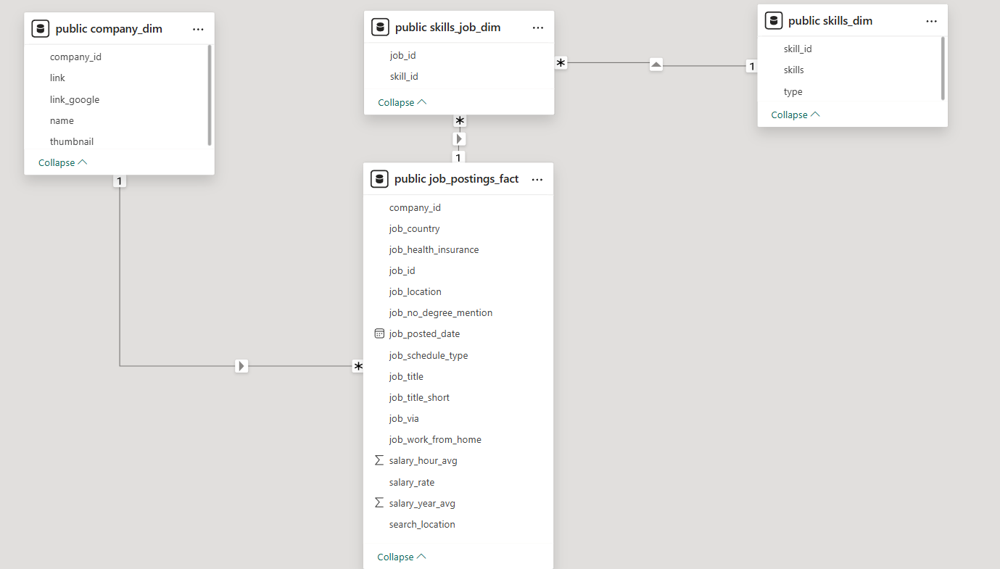

# Project: Data Analyst Jobs Analysis

# Introduction
Hey there! This is my first SQL project that is entirely based on the SQL course offered by no other than "Luke Barousse" and "Kelly Adams". Dive into the job market focused on Data Analyst roles! This project is best for people who want to explore different career opportunities or for people who are aiming to identify high-potential business startups. This helped me focus on what I should prioritize in order to be a successful Data Analyst. 

SQL course of Luke Barousse: [SQL for Data Analysis](https://www.lukebarousse.com/sql)

SQL Queries: [SQL Project Folder](/project_sql/)

# Background
This project explores the top-paying Data Science job postings in the marketplace for 2023. The inspiration for this project stems from my keen interest in learning SQL and identifying my ideal career path in the future. Specifically, I will explore Data Analyst job postings to determine the essential skills required for this role.

The project will primarily focus on commonly used skills, in-demand skills, top-paying skills, and the most optimal skills in the Data Analyst field. Additionally, I will analyze whether remote work is more advantageous than non-remote work.

There are four(4) tables in this dataset: **job_postings_fact table**, **company_dim table**, **skills_job_dim table**, and **skills_dim table**

## ERD for this dataset

**This is the Entity Relationship diagram with this dataset. One(1) table for the job postings, two(2) tables that has the information for the skills required for that job, and one(1) table for the company associated with that job.**

Relationships:
   - 1 company can have multiple job postings
   - 1 job postings can have multiple skills required
   - 1 skill can be on multiple job postings

## Questions needed for this SQL queries
Questions:
1. What are the top paying Data Analyst Jobs?
   a.Top paying for Remote? Non-Remote?
2. What are the top skills required for these top paying remote data analyst job?
3. Whare skills are the most in-demand for data analyst?
4. What are the top skills based on the average salary for data analyst?
5. What are the most optimal skills to learn for both high salary and most used?

Personal Question: Is remote data analysis job suitable for me than non-remote?

# Tools I Used
These are the tools I personally used to tackle this project:

   - SQL
   - PostgreSQL
   - Power BI
   - Visual Studio Code
   - Git and Github

# Analysis

# Dashboard Visualization
## Remote Data Analyst Job Dashboard

## Non-Remote Data Analyst Job Dashboard

# Learnings

# Conclusion