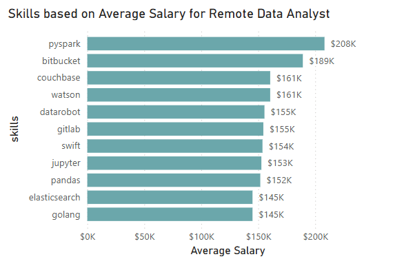
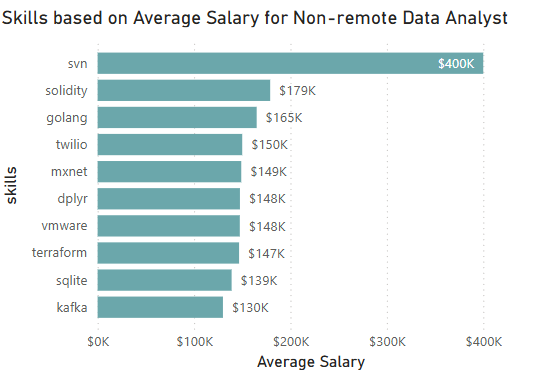
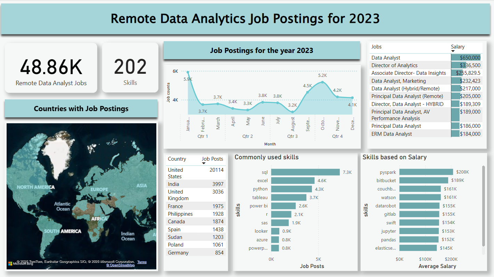
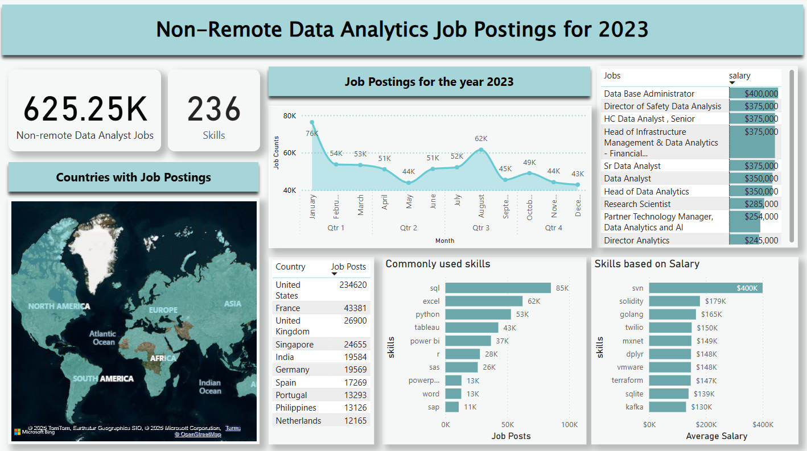

# Project: Data Analyst Jobs Analysis

# Introduction
Hey there! This is my first SQL project that is entirely based on the SQL course offered by no other than "Luke Barousse" and "Kelly Adams". Dive into the job market focused on Data Analyst roles! This project is best for people who want to explore different career opportunities or for people who are aiming to identify high-potential business startups. This helped me focus on what I should prioritize in order to be a successful Data Analyst. 

SQL course of Luke Barousse: [SQL for Data Analysis](https://www.lukebarousse.com/sql)

SQL Queries: [SQL Project Folder](/project_sql/)


# Background
This project explores the top-paying Data Science job postings in the marketplace for 2023. The inspiration for this project stems from my keen interest in learning SQL and identifying my ideal career path in the future. Specifically, I will explore Data Analyst job postings to determine the essential skills required for this role.

The project will primarily focus on commonly used skills, in-demand skills, top-paying skills, and the most optimal skills in the Data Analyst field. Additionally, I will analyze whether remote work is more advantageous than non-remote work.

There are four(4) tables in this dataset: **job_postings_fact table**, **company_dim table**, **skills_job_dim table**, and **skills_dim table**

## ERD for this dataset

**This is the Entity Relationship diagram with this dataset. One(1) table for the job postings, two(2) tables that has the information for the skills required for that job, and one(1) table for the company associated with that job.**

Relationships:
   - 1 company can have multiple job postings
   - 1 job postings can have multiple skills required
   - 1 skill can be on multiple job postings


## Questions needed for this SQL queries
Questions:
1. What are the top paying Data Analyst Jobs?
   a.Top paying for Remote? Non-Remote?
2. What are the top skills required for these top paying data analyst job?
3. Whare skills are the most in-demand for data analyst?
4. What are the top skills based on the average salary for data analyst?
5. What are the most optimal skills to learn for both high salary and most used?

Personal Question: Is remote data analysis job suitable for me than non-remote?

# Tools I Used
These are the tools I personally used to tackle this project:

   - **SQL** – The backbone of the project's overall analysis. It will be used primarily to run queries for my analysis. My goal in using SQL is to learn and familiarize myself with SQL queries and understand how to apply them for data analysis.
   - **PostgreSQL** - The Relational Database Management System (RDBMS) I used to store, organize, and query the job posting dataset.
   - Power BI - The visualization tool that I used for creating clear, insightful, and visually appealing visualizations to effectively communicate my findings.
   - Visual Studio Code - The IDE used for the entire analysis process, from creating tables to querying and analyzing the dataset. This will serve as my workspace for writing and executing SQL queries.
   - Git and Github - Used for version control and sharing my analysis, ensuring collaboration and project tracking.

# Analysis
For this analysis, I focused on finding the job market based on the Data Analyst job postings, specifically finding Data Analyst job posts that are offering Full-time jobs applications. I conducted two separate analyses: one for remote Data Analyst jobs and another for non-remote Data Analyst jobs to compare both findings. Here is how I approached each analysis questions:

## 1. What are the top paying Data Analyst Jobs?
To identify the top-paying Data Analyst jobs, I filtered the records to include only those under Data Analyst job titles and separated them into remote and non-remote positions to compare salary differences. For the top job postings, I set a limit of 10 and order the list in descending order to display only the highest-paying Data Analyst jobs.

### Top paying remote Data Analyst Jobs
This query highlights the top paying jobs for remote Data Analyst job positions:

```sql
SELECT
   j.job_id,
   j.job_title AS job_name,
   c.name AS company,
   j.job_location,
   j.job_work_from_home AS job_remote,
   j.job_schedule_type,
   j.salary_year_avg AS salary
FROM
   job_postings_fact AS j
INNER JOIN company_dim AS c ON j.company_id = c.company_id
WHERE
   j.job_title_short IN ('Data Analyst') AND 
   j.job_schedule_type LIKE '%Full-time%' AND
   salary_year_avg IS NOT NULL AND
   j.job_work_from_home = TRUE
ORDER BY
   salary DESC
LIMIT 10
```
### Top paying non-remote Data Analyst Jobs
This query highlights the top paying job for non-remote Data Analyst job positions:

```sql
SELECT
   j.job_id,
   j.job_title AS job_name,
   c.name AS company,
   j.job_location,
   j.job_work_from_home AS job_remote,
   j.job_schedule_type,
   j.salary_year_avg AS salary
FROM
   job_postings_fact AS j
INNER JOIN company_dim AS c ON j.company_id = c.company_id
WHERE
   j.job_title_short IN ('Data Analyst') AND 
   j.job_schedule_type LIKE '%Full-time%' AND 
   salary_year_avg IS NOT NULL AND
   j.job_work_from_home = FALSE
ORDER BY
   salary DESC
LIMIT 10
```

### Bar chart visualization


*This bar graph visualizes the top paying remote Data Analyst jobs that offers Full-time positions.*


*This bar graph visualizes the top paying non-remote Data Analyst jobs that offers Full-time positions.*

### Insights and Comparison:

- **Difference in Salary Range** - For remote Data Analyst jobs, salaries range from $184,000 to $650,000. In contrast, non-remote Data Analyst job salaries range from $245,000 to $400,000. This indicates that the highest salary offer, $650,000, is for a remote Data Analyst position.

- **Salary Stability Across Job Positions** - The salary gaps between remote Data Analyst job positions are significant. Apart from the highest-paying position, the rest show a sharp decline, with at least a $313,000 difference between the highest-paying position (Data Analyst) and the second highest (Director of Analytics). Meanwhile, for non-remote job positions, the salary differences are much smaller, making the salary distribution more stable and less variable compared to remote positions.

- **Diverse Job positions** - Both remote and non-remote Data Analyst jobs hafve different job titles with different specializations. This indicates that there are multiple routes that you can take if you want to consider pursuing the Analytics field. However, the common job title that can be found on both remote and non-remote are Data Analyst and Director of Analytics.   


## 2. What are the top skills required for these top paying data analyst job?

To identify the skills required for these top-paying Data Analyst jobs, I used the *INNER JOIN* function to combine the job postings with their respective skill requirements. Following the same process used to find the highest-paying jobs, I then included their skills and used the COUNT function to determine the most common skills required for each job.

### Skills used by the top-paying Remote Data Analyst Jobs
This query highlights the skills used by the top-paying remote data analyst job positions:

```sql
WITH top_salary_remote AS (
    SELECT
        j.job_id,
        j.job_title AS job_name,
        j.job_location,
        j.job_work_from_home AS job_remote,
        j.job_schedule_type,
        j.salary_year_avg AS salary
    FROM
        job_postings_fact AS j
    WHERE
        j.job_title_short IN ('Data Analyst') AND 
        j.job_schedule_type LIKE '%Full-time%' AND 
        salary_year_avg IS NOT NULL AND
        j.job_work_from_home = TRUE
    ORDER BY
        salary DESC
    LIMIT 10
)

SELECT
    s.skills AS skills,
    COUNT(top_salary_remote.job_id) AS total_skills
FROM
    skills_dim AS s
INNER JOIN skills_job_dim AS sj ON s.skill_id = sj.skill_id
INNER JOIN top_salary_remote ON sj.job_id = top_salary_remote.job_id
GROUP BY
    s.skills
ORDER BY
    total_skills DESC
LIMIT 10
```
### Skills used by the top-paying Non-Remote Data Analyst Jobs
This query highlights the skills used by the top-paying non-remote data analyst job positions:

```sql
WITH top_salary_nonremote AS (
    SELECT
        j.job_id,
        j.job_title AS job_name,
        j.job_location,
        j.job_work_from_home AS job_remote,
        j.job_schedule_type,
        j.salary_year_avg AS salary
    FROM
        job_postings_fact AS j
    WHERE
        j.job_title_short IN ('Data Analyst') AND 
        j.job_schedule_type LIKE '%Full-time%' AND  
        salary_year_avg IS NOT NULL AND
        j.job_work_from_home = FALSE
    ORDER BY
        salary DESC
    LIMIT 10
)


SELECT
    s.skills AS skills,
    COUNT(top_salary_nonremote.job_id) AS total_skills
FROM
    skills_dim AS s
INNER JOIN skills_job_dim AS sj ON s.skill_id = sj.skill_id
INNER JOIN top_salary_nonremote ON sj.job_id = top_salary_nonremote.job_id
GROUP BY
    s.skills
ORDER BY
    total_skills DESC
LIMIT 10

```

### Bar chart visualization


*This bar graph visualizes the skills used by the top-paying remote Data Analyst job postions.*


*This bar graph visualizes the skills used by the top-paying non-remote Data Analyst job postions.*

### Insights and Comparison:

- **Similarities of skills** - Based on the bar chart,  both remote and non-remote Data Analyst jobs share the same top five most commonly used skills: *SQL*, *Python*, *Tableau*, *R*, and *Excel*. These 5 skills are mainly use as data analysis and data visualization.

- **Wide variety of skills** - In addition to the top five commonly used skills for high-paying Data Analyst jobs, there are several other tools and technologies that these top paying jobs use. These include Snowflake, a data warehousing software; Atlassian and Jira, which are project management tools; Azure, a cloud computing platform; and SAS, GitHub, Kafka, and MATLAB, which serve various specialized functions in data analysis.

## 3. What skills are in demand for data analyst job?
 For this question, I considered all job schedules, from part-time to full-time, to identify the most in-demand skills in the Data Analyst job market. This helps determine which skills a person should focus on to increase their job qualifications and opportunities.

### In-demand skills for Remote Data Analyst Jobs

This query identifies the most in-demand skills for remote Data Analyst jobs:

```sql
SELECT 
    s.skills,
    COUNT(j.job_id) AS demand_skill
FROM
    skills_dim AS s 
INNER JOIN skills_job_dim AS sj ON sj.skill_id = s.skill_id
INNER JOIN job_postings_fact AS j ON sj.job_id = j.job_id
WHERE
    j.job_title_short IN ('Data Analyst') AND
    j.job_work_from_home = TRUE
GROUP BY
    s.skills
ORDER BY
    demand_skill DESC
LIMIT 5
```
### Skills used by the top-paying Non-Remote Data Analyst Jobs
This query identifies the most in-demand skills for remote Data Analyst jobs:

```sql
SELECT 
    s.skills,
    COUNT(j.job_id) AS demand_skill
FROM
    skills_dim AS s 
INNER JOIN skills_job_dim AS sj ON sj.skill_id = s.skill_id
INNER JOIN job_postings_fact AS j ON sj.job_id = j.job_id
WHERE
    j.job_title_short IN ('Data Analyst') AND
    j.job_work_from_home = FALSE
GROUP BY
    s.skills
ORDER BY
    demand_skill DESC
LIMIT 5
```

### Table visualization
| Skills |Demands|
| ------ |:-----:|
| SQL    | 7291  | 
| Excel  | 4611  |
| Python | 4330  |
|Tableau | 3745  |
|Power BI| 2609  |

*This table visualizes the most in-demand skills used for remote Data Analyst jobs.*


| Skills |Demands|
| ------ |:-----:|
| SQL    | 85337 | 
| Excel  | 62420 |
| Python | 52996 |
|Tableau | 42809 |
|Power BI| 36859 |

*This table visualizes the most in-demand skills used for non-remote Data Analyst jobs.*

### Insights and Comparison:
- **Skill similarities** - Both remote and non-remote have the same in-demand skills which are SQL, Excel, Python, Tableau, and Power BI. This shows that these skills are necessary to learn in order to pursue Data Analysis.

- **Knowledge for tools and language** - The top in-demand skills indicate that three of them are used for data cleaning, each utilizing a different language for data transformation. The other two skills are data visualization tools—Tableau, which focuses primarily on visualizations, and Power BI, which supports both data cleaning using DAX formulas and visualization.

## 4. What are the top skills used based on the average salary for data analyst?
For this question, I wanted to identify the top skills based on the highest average salary for Data Analyst job positions. I used the *Average* function to calculate the average yearly salary of job postings linked to each skill. The purpose of this is to determine which skills provide a higher chance of securing high-paying Data Analyst jobs.

### Top skills based on average salary for Remote Data Analyst Jobs

This query identifies the top skills based on the average salary for remote data analyst jobs:

```sql
SELECT
    s.skills,
    ROUND(AVG(salary_year_avg), 0) AS salary
FROM    
    skills_dim AS s
INNER JOIN skills_job_dim AS sj ON s.skill_id = sj.skill_id
INNER JOIN job_postings_fact AS j ON sj.job_id = j.job_id
WHERE
    j.job_title_short IN ('Data Analyst') AND
    j.job_schedule_type LIKE '%Full-time%' AND 
    j.salary_year_avg IS NOT NULL AND
    j.job_work_from_home = TRUE
GROUP BY
    s.skills
ORDER BY 
    salary DESC
LIMIT 20
```
### Top skills based on average salary for Non-Remote Data Analyst Jobs
This query identifies the top skills based on the average salary for non-remote data analyst jobs:

```sql
SELECT
    s.skills,
    ROUND(AVG(salary_year_avg), 0) AS salary
FROM    
    skills_dim AS s
INNER JOIN skills_job_dim AS sj ON s.skill_id = sj.skill_id
INNER JOIN job_postings_fact AS j ON sj.job_id = j.job_id
WHERE
    j.job_title_short IN ('Data Analyst') AND
    j.job_schedule_type LIKE '%Full-time%' AND
    j.salary_year_avg IS NOT NULL AND
    j.job_work_from_home = FALSE
GROUP BY
    s.skills
ORDER BY 
    salary DESC
LIMIT 20
```

### Bar chart visualization


*This bar graph visualizes the skills used by the top-paying remote Data Analyst job postions.*




*This bar graph visualizes the skills used by the top-paying non-remote Data Analyst job postions.*

### Insights and Comparison:

- **Higher Difficulty earns more** - The bar graph shows that for both remote and non-remote Data Analyst jobs, skills with higher difficulty tend to have higher salaries.Programming languages like Solidity, frameworks like PySpark, version control systems like SVN, and database platforms like Couchbase have high average salaries. On the other hand, commonly used skills for entry-level data analysis, such as SQL and Excel, are not included in the chart due to their lower average salaries.

 - **Diverse Skills to focus** - Skills with higher average salaries tend to focus on Big Data and Machine Learning. Technologies like PySpark, MXNet, and DataRobot are commonly used for solving Big Data and Machine Learning problems. On the other hand, for those interested in Cloud Infrastructure, skills like VMware, Elasticsearch, and Twilio are also associated with high average salaries. Similarly, for those focusing on Data Analysis, frameworks like dplyr (for R) and pandas (for Python) can also be associated with high average salaries.

## 5. What are the most optimal skills to learn for both high salary and most used?

For this question, I analyzed skills based on both their average salary and demand to determine the most optimal skills to learn and prioritize. Some skills are highly in demand but offer lower salaries, while others are less commonly required yet provide higher salaries.
To illustrate this analysis, I will present both a table and a combo chart:

- The table will display the top 25 skills based on demand and salary.
- The combo chart will visualize the correlation between demand and salary, highlighting key trends.

### Optimal Skills for Remote Data Analyst Jobs
This query identifies the most optimal skills based on the demands and the average saalary for remote data analyst jobs:

```sql
SELECT
    s.skills AS skills,
    COUNT(sj.job_id) AS demand,
    ROUND(AVG(j.salary_year_avg), 0) AS salary
FROM 
    skills_dim AS s
INNER JOIN skills_job_dim AS sj ON s.skill_id = sj.skill_id
INNER JOIN job_postings_fact AS j ON sj.job_id = j.job_id
WHERE
    j.job_title_short IN ('Data Analyst') AND
    j.salary_year_avg IS NOT NULL AND
    j.job_schedule_type LIKE '%Full-time%' AND
    j.job_work_from_home = TRUE
GROUP BY
    s.skills
HAVING
    COUNT(j.job_id) > 10
ORDER BY
      salary DESC,
      demand DESC
LIMIT 25


```
### Optimal Skill for Non-Remote Data Analyst Jobs
This query identifies the most optimal skills based on the demands and the average saalary for non-remote data analyst jobs:

```sql
SELECT
    s.skills AS skills,
    COUNT(sj.job_id) AS demand,
    ROUND(AVG(j.salary_year_avg), 0) AS salary
FROM 
    skills_dim AS s
INNER JOIN skills_job_dim AS sj ON s.skill_id = sj.skill_id
INNER JOIN job_postings_fact AS j ON sj.job_id = j.job_id
WHERE
    j.job_title_short IN ('Data Analyst') AND
    j.salary_year_avg IS NOT NULL AND
    j.job_schedule_type LIKE '%Full-time%' AND
    j.job_work_from_home = FALSE
GROUP BY
    s.skills
HAVING
    COUNT(j.job_id) > 10
ORDER BY
      salary DESC,
      demand DESC
LIMIT 25
```

### Table visualization

| Skill       | Demand | Average Salary (USD) |
|------------|--------|---------------------|
| Hadoop     | 21     | 116,916             |
| Go         | 25     | 114,917             |
| Confluence | 11     | 114,210             |
| BigQuery   | 12     | 113,375             |
| Snowflake  | 37     | 112,948             |
| AWS        | 29     | 111,954             |
| Azure      | 32     | 109,427             |
| Java       | 16     | 107,338             |
| SSIS       | 11     | 106,382             |
| Looker     | 48     | 105,229             |
| Jira       | 20     | 104,918             |
| Spark      | 12     | 104,417             |
| Oracle     | 36     | 103,062             |
| Redshift   | 15     | 102,466             |
| Python     | 229    | 101,752             |
| R          | 143    | 101,513             |
| NoSQL      | 13     | 101,414             |
| Qlik       | 13     | 99,631              |
| Tableau    | 221    | 99,591              |
| SAS        | 124    | 98,723              |
| SSRS       | 13     | 98,338              |
| Flow       | 26     | 97,850              |
| SQL Server | 34     | 97,426              |
| JavaScript | 19     | 97,328              |
| SQL        | 381    | 97,272              |

*This table shows the top 25 optimal skills to learn for remote Data Analyst job positions.*


| Skill        | Demand | Average Salary (USD) |
|-------------|--------|---------------------|
| Kafka       | 40     | 129,999             |
| PyTorch     | 20     | 125,226             |
| Perl        | 20     | 124,686             |
| TensorFlow  | 24     | 120,647             |
| MongoDB     | 46     | 119,815             |
| Airflow     | 65     | 116,546             |
| Scala       | 52     | 115,563             |
| Spark       | 167    | 115,174             |
| Linux       | 54     | 114,726             |
| Confluence  | 50     | 114,574             |
| Splunk      | 15     | 112,928             |
| Git         | 68     | 112,816             |
| GCP         | 75     | 112,688             |
| Snowflake   | 195    | 111,995             |
| Plotly      | 21     | 111,908             |
| Phoenix     | 19     | 111,792             |
| Shell       | 41     | 111,738             |
| Unix        | 34     | 111,428             |
| Bash        | 11     | 111,097             |
| Hadoop      | 115    | 110,740             |
| PySpark     | 43     | 110,617             |
| Databricks  | 88     | 110,473             |
| Express     | 91     | 110,019             |
| Redshift    | 71     | 109,915             |
| PHP         | 28     | 109,553             |


*This table shows the top 25 optimal skills to learn for non-remote Data Analyst job positions.*


### Bar chart visualization
.png)

*This bar graph visualizes the correlation between demands and salary of skills for remote Data Analyst job positions.*


.png)

*This bar graph visualizes the correlation between demands and salary of skills for non-remote Data Analyst job positions.*


### Insights and Comparison:
- **Higher Demand, Lower Salary** - As shown in the combo chart for both remote and non-remote Data Analyst jobs, skills with high demand tend to have lower salaries, while less in-demand skills often offer higher average salaries. For remote jobs, demand and salary fluctuate—some skills rank high in both, while others remain low. In contrast, non-remote jobs show an increasing salary trend. However, both charts confirm that the highest-demand skills tend to have the lowest salaries.

- **Skill Requirements** - In the table of the top 25 skills based on demand and salary, SQL has the highest demand for remote Data Analyst roles but also the lowest average salary, as it is a prerequisite for pursuing a Data Analyst career. However, for non-remote Data Analyst roles, skills related to Data Engineering and Data Warehousing are in higher demand than those primarily focused on Data Analysis.


- **Most optimal skill to learn** - When determining which skill to learn and prioritize, both job market demand and average salary should be considered. A skill with high demand but low salary may not be ideal, just as a high-paying skill with low demand may not provide enough job opportunities. With this in mind, Python is the best skill to pursue for a remote Data Analyst role. As shown in the table, Python has at least 229 job postings, making it highly in demand. Additionally, it offers an average salary of over $100,000, making it a strong choice for learning. For non-remote Data Analyst roles, there are still many skills to explore. However, I have chosen to focus on MongoDB, as it is a crucial database tool that I need to learn.


# Dashboard Visualization
I created a dashboard visualization for both remote and non-remote Data Analyst job postings to provide an overall view of the Data Analyst job market in 2023. Additionally, this dashboard helps individuals considering non-remote roles by highlighting key trends and offering a clear visualization of the non-remote job landscape.

For the dashboard, the metrics that is shown are the following:

- Total Job Postings for remote non-remote Data Analyst Jobs
- Total skills required for remote and non-remote Data Analyst Jobs(unique skills)
- Job postings for the year 2023
- Job title based on salary (top 10)
- Total job post per country
- Commonly used skills (Top 10)
- Skills based on average salary (Top 10)


## Remote Data Analyst Job Dashboard


*This dashboard visualizes the overall Remote Data Analyst Job Postings for the year 2023*

## Non-Remote Data Analyst Job Dashboard



*This dashboard visualizes the overall Non-Remote Data Analyst Job Postings for the year 2023*

# Conclusion
This analysis helped me determine which skills to prioritize for pursuing a career in Data Analysis. I was able to identify the essential skills needed to secure a great Data Analyst role. Additionally, it provided insights into the demand for Data Analysts in the job market, especially amid rising AI advancements and speculations that IT jobs may decline. However, this analysis confirms that Data Analyst roles remain in high demand this year.

### Answers to my questions:


# Learnings

