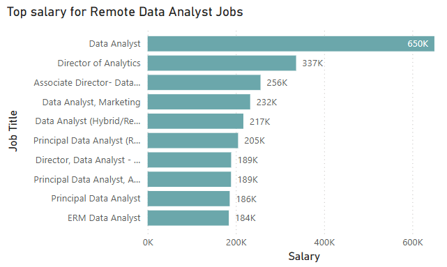

# Project: Data Analyst Jobs Analysis

# Introduction
Hey there! This is my first SQL project that is entirely based on the SQL course offered by no other than "Luke Barousse" and "Kelly Adams". Dive into the job market focused on Data Analyst roles! This project is best for people who want to explore different career opportunities or for people who are aiming to identify high-potential business startups. This helped me focus on what I should prioritize in order to be a successful Data Analyst. 

SQL course of Luke Barousse: [SQL for Data Analysis](https://www.lukebarousse.com/sql)

SQL Queries: [SQL Project Folder](/project_sql/)


# Background
This project explores the top-paying Data Science job postings in the marketplace for 2023. The inspiration for this project stems from my keen interest in learning SQL and identifying my ideal career path in the future. Specifically, I will explore Data Analyst job postings to determine the essential skills required for this role.

The project will primarily focus on commonly used skills, in-demand skills, top-paying skills, and the most optimal skills in the Data Analyst field. Additionally, I will analyze whether remote work is more advantageous than non-remote work.

There are four(4) tables in this dataset: **job_postings_fact table**, **company_dim table**, **skills_job_dim table**, and **skills_dim table**

## ERD for this dataset

**This is the Entity Relationship diagram with this dataset. One(1) table for the job postings, two(2) tables that has the information for the skills required for that job, and one(1) table for the company associated with that job.**

Relationships:
   - 1 company can have multiple job postings
   - 1 job postings can have multiple skills required
   - 1 skill can be on multiple job postings


## Questions needed for this SQL queries
Questions:
1. What are the top paying Data Analyst Jobs?
   a.Top paying for Remote? Non-Remote?
2. What are the top skills required for these top paying data analyst job?
3. Whare skills are the most in-demand for data analyst?
4. What are the top skills based on the average salary for data analyst?
5. What are the most optimal skills to learn for both high salary and most used?

Personal Question: Is remote data analysis job suitable for me than non-remote?

# Tools I Used
These are the tools I personally used to tackle this project:

   - **SQL** – The backbone of the project's overall analysis. It will be used primarily to run queries for my analysis. My goal in using SQL is to learn and familiarize myself with SQL queries and understand how to apply them for data analysis.
   - **PostgreSQL** - The Relational Database Management System (RDBMS) I used to store, organize, and query the job posting dataset.
   - Power BI - The visualization tool that I used for creating clear, insightful, and visually appealing visualizations to effectively communicate my findings.
   - Visual Studio Code - The IDE used for the entire analysis process, from creating tables to querying and analyzing the dataset. This will serve as my workspace for writing and executing SQL queries.
   - Git and Github - Used for version control and sharing my analysis, ensuring collaboration and project tracking.

# Analysis
For this analysis, I focused on finding the job market based on the Data Analyst job postings, specifically finding Data Analyst job posts that are offering Full-time jobs applications. I conducted two separate analyses: one for remote Data Analyst jobs and another for non-remote Data Analyst jobs to compare both findings. Here is how I approached each analysis questions:

## 1. What are the top paying Data Analyst Jobs?
To identify the top-paying Data Analyst jobs, I filtered the records to include only those under Data Analyst job titles and separated them into remote and non-remote positions to compare salary differences. For the top job postings, I set a limit of 10 and order the list in descending order to display only the highest-paying Data Analyst jobs.

### Top paying remote Data Analyst Jobs
This query highlights the top paying jobs for remote Data Analyst job positions:

```sql
SELECT
   j.job_id,
   j.job_title AS job_name,
   c.name AS company,
   j.job_location,
   j.job_work_from_home AS job_remote,
   j.job_schedule_type,
   j.salary_year_avg AS salary
FROM
   job_postings_fact AS j
INNER JOIN company_dim AS c ON j.company_id = c.company_id
WHERE
   j.job_title_short IN ('Data Analyst') AND 
   j.job_schedule_type LIKE '%Full-time%' AND
   salary_year_avg IS NOT NULL AND
   j.job_work_from_home = TRUE
ORDER BY
   salary DESC
LIMIT 10
```
### Top paying non-remote Data Analyst Jobs
This query highlights the top paying job for non-remote Data Analyst job positions:

```sql
SELECT
   j.job_id,
   j.job_title AS job_name,
   c.name AS company,
   j.job_location,
   j.job_work_from_home AS job_remote,
   j.job_schedule_type,
   j.salary_year_avg AS salary
FROM
   job_postings_fact AS j
INNER JOIN company_dim AS c ON j.company_id = c.company_id
WHERE
   j.job_title_short IN ('Data Analyst') AND 
   j.job_schedule_type LIKE '%Full-time%' AND 
   salary_year_avg IS NOT NULL AND
   j.job_work_from_home = FALSE
ORDER BY
   salary DESC
LIMIT 10
```

### Bar chart visualization

*This bar graph visualizes the top paying remote Data Analyst jobs that offers Full-time positions.*


*This bar graph visualizes the top paying non-remote Data Analyst jobs that offers Full-time positions.*

### Insights and Comparison:

- **Difference in Salary Range** - For remote Data Analyst jobs, salaries range from $184,000 to $650,000. In contrast, non-remote Data Analyst job salaries range from $245,000 to $400,000. This indicates that the highest salary offer, $650,000, is for a remote Data Analyst position.

- **Salary Stability Across Job Positions** - The salary gaps between remote Data Analyst job positions are significant. Apart from the highest-paying position, the rest show a sharp decline, with at least a $313,000 difference between the highest-paying position (Data Analyst) and the second highest (Director of Analytics). Meanwhile, for non-remote job positions, the salary differences are much smaller, making the salary distribution more stable and less variable compared to remote positions.

- **Diverse Job positions** - Both remote and non-remote Data Analyst jobs hafve different job titles with different specializations. This indicates that there are multiple routes that you can take if you want to consider pursuing the Analytics field. However, the common job title that can be found on both remote and non-remote are Data Analyst and Director of Analytics.   


## 2. What are the top skills required for these top paying data analyst job?

To identify the skills required for these top-paying Data Analyst jobs, I used the *INNER JOIN* function to combine the job postings with their respective skill requirements. Following the same process used to find the highest-paying jobs, I then included their skills and used the COUNT function to determine the most common skills required for each job.

### Skills used by the top-paying Remote Data Analyst Jobs
This query highlights the skills used by the top-paying remote data analyst job positions:

```sql
WITH top_salary_remote AS (
    SELECT
        j.job_id,
        j.job_title AS job_name,
        j.job_location,
        j.job_work_from_home AS job_remote,
        j.job_schedule_type,
        j.salary_year_avg AS salary
    FROM
        job_postings_fact AS j
    WHERE
        j.job_title_short IN ('Data Analyst') AND 
        j.job_schedule_type = 'Full-time' AND 
        salary_year_avg IS NOT NULL AND
        j.job_work_from_home = TRUE
    ORDER BY
        salary DESC
    LIMIT 10
)

SELECT
    s.skills AS skills,
    COUNT(top_salary_remote.job_id) AS total_skills
FROM
    skills_dim AS s
INNER JOIN skills_job_dim AS sj ON s.skill_id = sj.skill_id
INNER JOIN top_salary_remote ON sj.job_id = top_salary_remote.job_id
GROUP BY
    s.skills
ORDER BY
    total_skills DESC
LIMIT 10
```
### Skills used by the top-paying Non-Remote Data Analyst Jobs
This query highlights the skills used by the top-paying non-remote data analyst job positions:

```sql
WITH top_salary_nonremote AS (
    SELECT
        j.job_id,
        j.job_title AS job_name,
        j.job_location,
        j.job_work_from_home AS job_remote,
        j.job_schedule_type,
        j.salary_year_avg AS salary
    FROM
        job_postings_fact AS j
    WHERE
        j.job_title_short IN ('Data Analyst') AND 
        j.job_schedule_type = 'Full-time' AND 
        salary_year_avg IS NOT NULL AND
        j.job_work_from_home = FALSE
    ORDER BY
        salary DESC
    LIMIT 10
)


SELECT
    s.skills AS skills,
    COUNT(top_salary_nonremote.job_id) AS total_skills
FROM
    skills_dim AS s
INNER JOIN skills_job_dim AS sj ON s.skill_id = sj.skill_id
INNER JOIN top_salary_nonremote ON sj.job_id = top_salary_nonremote.job_id
GROUP BY
    s.skills
ORDER BY
    total_skills DESC
LIMIT 10

```

### Bar chart visualization

*This bar graph visualizes the skills used by the top-paying remote Data Analyst job postions.*


*This bar graph visualizes the skills used by the top-paying non-remote Data Analyst job postions.*

### Insights and Comparison:

- **Similarities of skills** - Based on the bar chart,  both remote and non-remote Data Analyst jobs share the same top five most commonly used skills: *SQL*, *Python*, *Tableau*, *R*, and *Excel*. These 5 skills are mainly use as data analysis and data visualization.

- **Wide variety of skills** - In addition to the top five commonly used skills for high-paying Data Analyst jobs, there are several other tools and technologies that these top paying jobs use. These include Snowflake, a data warehousing software; Atlassian and Jira, which are project management tools; Azure, a cloud computing platform; and SAS, GitHub, Kafka, and MATLAB, which serve various specialized functions in data analysis.

## 3. What skills are in demand for data analyst job?


# Dashboard Visualization
## Remote Data Analyst Job Dashboard

## Non-Remote Data Analyst Job Dashboard

# Learnings

# Conclusion